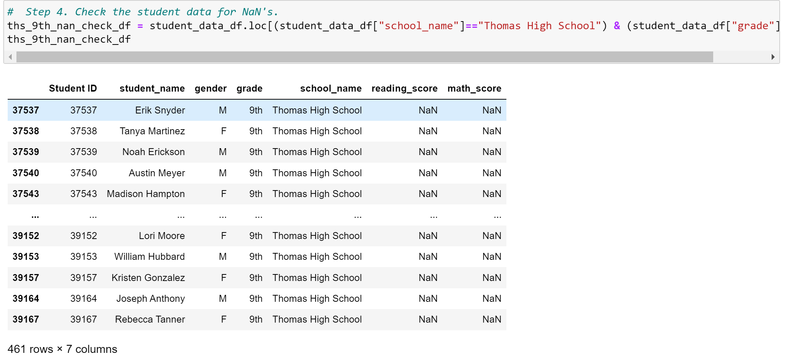

# School_District_Analysis

## Overview of School District Analysis

Utilization of Pandas and Python, while reading CSV files, and merging/creating dataframes.

## Purpose

The purpose of this challenge was to  My client was informed that academic dishonesty transpired during standardized testing within Thomas High School.In order to uphold academic state testing standards,I  replaced the math and reading scores of all ninth graders within Thomas High School, with NaNs. By eliminating the math and reading scores of Thomas High School, I was able to still keep the data intact and determined how these changes affected the overall analysis.

# Results

By first using the loc method, I was able to gather all ninth grader's math and reading scores from Thomas High School, and apply NaN. 

